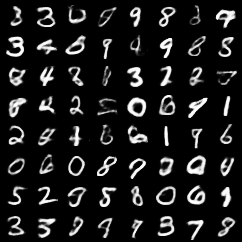
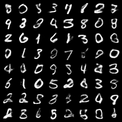
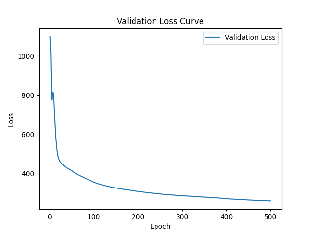

# Multimodal Variational Autoencoder for MNIST

This repository contains a PyTorch implementation of a Multimodal Variational
Autoencoder (MVAE) inspired by Mike Wu and Noah Goodman's paper
["Multimodal Generative Models for Scalable Weakly-Supervised Learning"](https://arxiv.org/abs/1802.05335).
It was originally built during a machine learning master-level project at TU Berlin and
has since been cleaned up as a portfolio-quality research engineering project.

The implementation focuses on a compact MNIST setting with two modalities:

- image modality: `28 x 28` grayscale digit images
- label modality: categorical digit labels from `0` to `9`

The model learns modality-specific encoders, combines latent Gaussian experts with a
product of experts, and decodes from the shared latent representation back into image
and label space.

## Results

Generated samples conditioned on digit label `6`:



Generated samples conditioned on digit label `5`:



Validation loss from the original training run:



## Installation

```bash
git clone git@github.com:MertAkil/MVAE.git
cd MVAE
python3 -m venv .venv
source .venv/bin/activate
python3 -m pip install --upgrade pip
python3 -m pip install -e ".[dev]"
```

This project targets Python 3.10 or newer. For GPU-specific PyTorch builds, use the
installation command recommended by the official PyTorch selector, then install this
project in editable mode.

## Usage

Generate samples from the included best checkpoint:

```bash
mvae-mnist sample \
  --condition-label 6 \
  --num-samples 64 \
  --checkpoint artifacts/checkpoints/mnist/final_best_epoch.pth.tar \
  --output-dir outputs/samples
```

Run a quick training smoke test:

```bash
mvae-mnist train \
  --epochs 1 \
  --batch-size 16 \
  --limit-train-batches 2 \
  --limit-val-batches 1 \
  --checkpoint-dir outputs/checkpoints
```

Run a lightweight importance-sampling evaluation:

```bash
mvae-mnist evaluate \
  --checkpoint artifacts/checkpoints/mnist/final_best_epoch.pth.tar \
  --condition-label 5
```

Useful conditioning options:

- `--condition-label 0` through `--condition-label 9` conditions on the label modality.
- `--condition-image-label 5` fetches a test-set image with that digit and conditions on
  the image modality.
- `--condition-label none --condition-image-label 5` performs image-only conditioning.
- `--prior` samples from the unit Gaussian prior without conditioning.
- `--device auto|cpu|cuda|mps` controls device selection.

## Repository Structure

```text
artifacts/checkpoints/mnist/     included best checkpoint
docs/assets/                     example outputs and training curves
src/mvae_mnist/                  package code and CLI
tests/                           focused unit tests
```

Only the best checkpoint is kept in the visible tree. New training outputs are written
to `outputs/` by default and ignored by Git. The repository history has not been
rewritten, so older large checkpoint blobs may still exist in Git history.

## Engineering Notes

The code intentionally keeps the original research architecture recognizable while
modernizing the project around it:

- package-based imports instead of current-working-directory scripts
- deterministic train/validation split and real MNIST test split
- explicit CPU/CUDA/MPS device handling
- modern PyTorch APIs without `.data`, `Variable`, or deprecated MNIST fields
- typed configuration objects for training, sampling, and paths
- test coverage for model shapes, conditioning behavior, ELBO sanity, and data splits
- CLI commands suitable for demos, smoke tests, and technical discussion

## Limitations

This is a compact research/portfolio project, not a production ML service. It currently
supports MNIST only, uses a small fully connected architecture, and does not include
experiment tracking, distributed training, or model registry integration. Those are
natural next steps if the project were expanded beyond its educational scope.
